# 📰 Flutter News App

A full-featured Flutter News App that lets users explore trending news, browse by category, bookmark favorites, personalize preferences, and more — built with clean architecture, state management, and local caching.

## ✨ Features

- 🔐 **Authentication**: Sign in / Sign up flow with persistent login using `shared_preferences`.
- 🏠 **Home Screen**:
  - Trending news section.
  - News categories (with navigation to all categories).
  - Tappable news cards that lead to detailed news pages.
- 📄 **News Details**:
  - Read the full article content.
  - Share news with others.
  - Bookmark news for later.
- 🔍 **Search Screen**: Quickly find any news article.
- 🔖 **Bookmarks Screen**: Access saved articles offline.
- 👤 **Profile Screen**:
  - Edit personal info and change profile picture.
  - Pick language and country preferences.
  - Log out functionality.
- 🚀 **Onboarding**: Shown only on first launch.
- 🌐 **REST API Integration** using `http`.

## 📦 Dependencies

### 🔐 Authentication & Local Preferences
- `shared_preferences`: Store user login info, language, country.
- `flutter_dotenv`: Load API keys and environment variables securely.

### 💾 Local Storage
- `hive_flutter`: Save bookmarked news articles.
- `path_provider`: Locate system directories for Hive.
- `build_runner` & `hive_generator`: Code generation for Hive.

### 🌐 Networking
- `http`: REST API calls to fetch news articles.

### 🖼️ Images & Media
- `cached_network_image`: Efficient image loading with caching.
- `image_picker`: Pick images from gallery or camera (used in profile).
- `flutter_svg`: Render SVG icons.

### 📤 Sharing & Rendering
- `share_plus`: Share news articles.
- `flutter_html`: Render HTML content inside news articles.

### 🧠 State Management & Dependency Injection
- `provider`: State management for user data and news lists.
- `get_it`: Dependency injection to manage services.

### 🧪 Dev Tools
- `flutter_test`: Flutter testing tools.
- `build_runner`, `hive_generator`: For model code generation.
- `flutter_launcher_icons`: Automatically generates app icons.
- `cupertino_icons`: iOS-style icons.

## 💻 Tech Stack

- **Flutter** (Dart)
- **State Management**: `provider`
- **API Communication**: `http`
- **Local Storage**: `Hive`, `SharedPreferences`
- **Dependency Injection**: `get_it`
- **Modular Clean Architecture**

## 🚀 Getting Started

1. **Clone the repository**:
   ```bash
   git clone https://github.com/your-username/flutter-news-app.git
   cd flutter-news-app
   ```

2. **Install dependencies**:
   ```bash
   flutter pub get
   ```

3. **Run build_runner for Hive**:
   ```bash
   flutter pub run build_runner build
   ```

4. **Add your `.env` file**:
   ```env
   API_KEY=your_api_key_here
   BASE_URL=https://api.example.com
   ```

5. **Run the app**:
   ```bash
   flutter run
   ```

## 📸 Screenshots

Here’s a preview of the app in action:

|  | 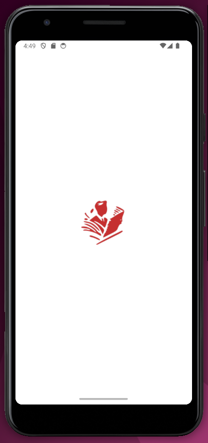 |  |
|--------------------------------|--------------------------------|--------------------------------|
|  |  |  |
|  |  |  |
|  |  |  |
|  | 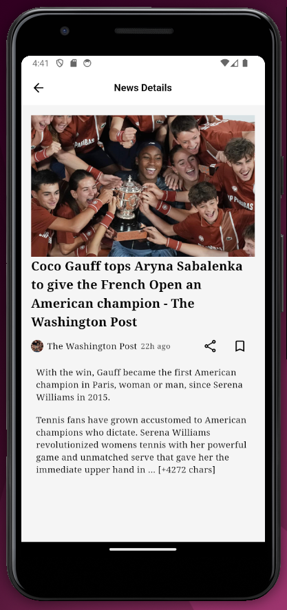 |  |
|  |  |  |
| 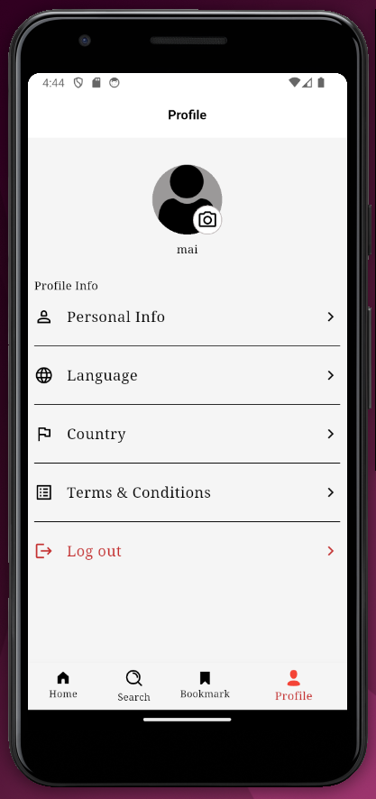 | 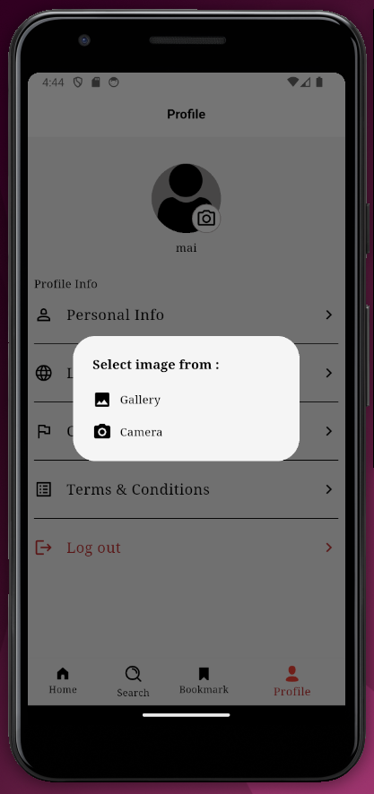 | 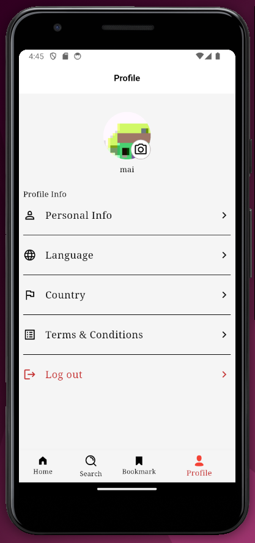 |
| 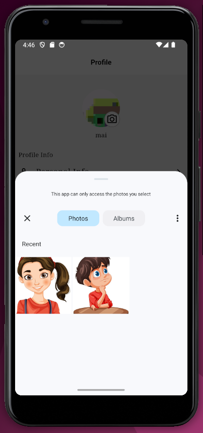 | 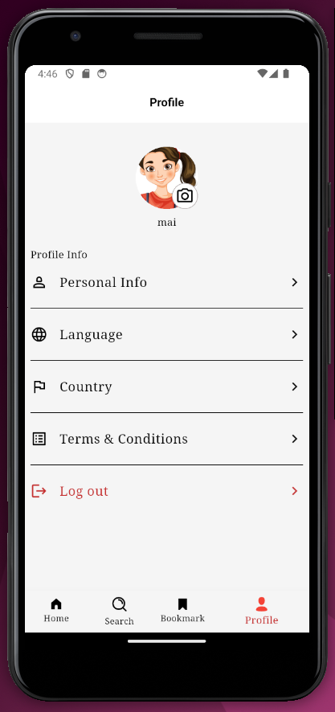 | 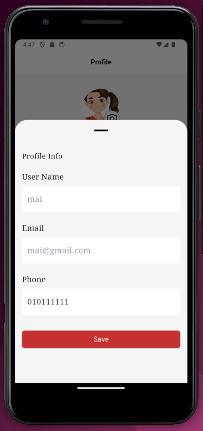 |
| 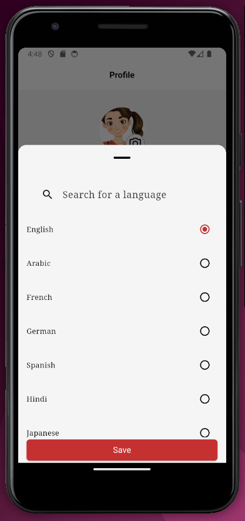 | 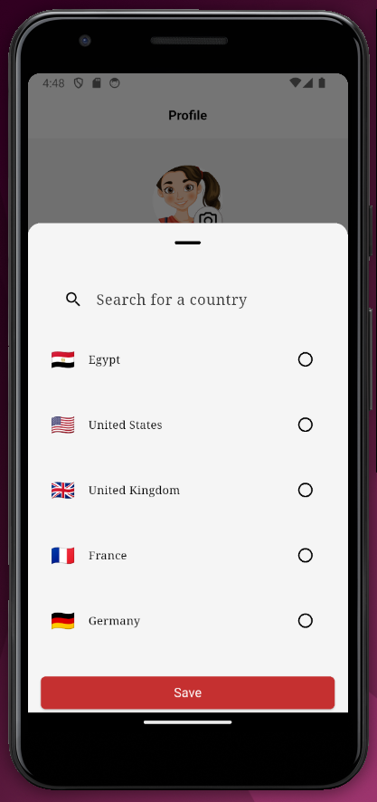 | 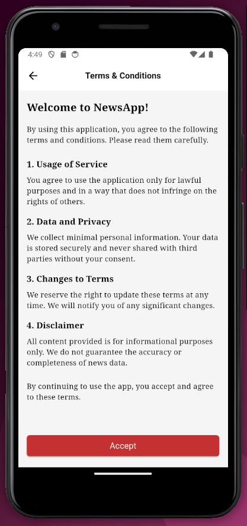 |
